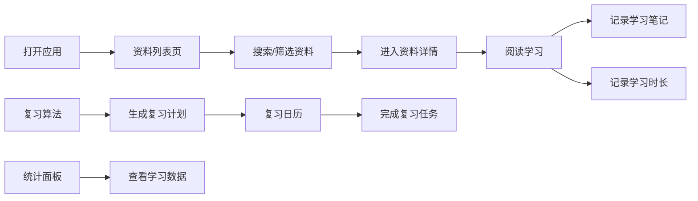
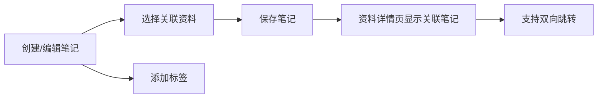

## 1. 产品概述

学习资源知识库是一个纯前端的个人知识管理工具，帮助用户系统化地管理学习资料、记录笔记、规划复习并追踪学习进度。所有数据存储在浏览器本地，无需后端服务支持。

- **核心价值**：整合学习资源管理、笔记记录、间隔重复复习、学习统计于一体，打造个人专属的知识管理闭环
- **目标用户**：学生、自学者、终身学习者，以及任何需要系统化管理知识的个人用户
- **解决问题**：学习资料分散、笔记查找困难、遗忘曲线缺乏科学管理、学习进度难以量化追踪

## 2. 核心功能

### 2.1 用户角色

| 角色 | 注册方式 | 核心权限 |
|------|----------|----------|
| 个人用户 | 无需注册，本地存储 | 完全访问所有功能，数据仅存储于当前浏览器 |

### 2.2 功能模块

1. **资料列表页**：资料卡片展示、分类筛选、标签过滤、全文搜索、排序功能
2. **资料详情页**：资料内容展示、相关笔记列表、关联标签、学习时长记录
3. **笔记编辑器**：富文本笔记编辑、笔记与资料关联、标签管理、笔记搜索
4. **复习日历**：日历视图展示复习计划、每日复习任务、间隔重复算法自动调度
5. **统计面板**：学习时长统计、资料完成度、复习趋势图表、标签分布分析
6. **设置页**：数据备份与恢复、复习算法参数调整、主题设置、数据管理

### 2.3 页面详情

| 页面名称 | 模块名称 | 功能描述 |
|---------|---------|----------|
| 资料列表页 | 搜索栏 | 全文搜索标题、内容、标签，支持关键词高亮 |
| 资料列表页 | 筛选面板 | 按分类、标签、学习进度多维度筛选 |
| 资料列表页 | 资料卡片 | 展示封面、标题、标签、进度、最近学习时间 |
| 资料详情页 | 内容区 | 展示资料完整内容，支持富文本渲染 |
| 资料详情页 | 笔记关联 | 显示该资料下的所有笔记，支持快速跳转编辑 |
| 笔记编辑器 | 编辑区 | 支持Markdown/富文本混合编辑，实时预览 |
| 笔记编辑器 | 关联管理 | 将笔记关联到多个资料，设置笔记标签 |
| 复习日历 | 月视图 | 日历热力图展示学习天数，标记复习任务 |
| 复习日历 | 任务列表 | 当日待复习内容，完成状态切换 |
| 统计面板 | 时长统计 | 每日/每周/每月学习时长柱状图 |
| 统计面板 | 进度概览 | 资料总数、已完成数、笔记总数、总学习时长 |
| 设置页 | 数据管理 | 导出JSON备份、导入恢复、清空数据 |
| 设置页 | 复习算法 | 调整SM-2间隔重复算法参数 |

## 3. 核心流程

### 3.1 用户主流程

用户打开应用后，首先浏览资料列表，通过搜索或筛选找到目标资料，进入详情页学习，学习过程中记录笔记，系统自动记录学习时长。根据间隔重复算法，系统自动生成复习计划，用户在复习日历中查看并完成每日复习任务。统计面板提供学习数据可视化，帮助用户了解学习习惯。

### 3.2 笔记关联流程

## 4. 用户界面设计

### 4.1 设计风格

**设计方向**：简约学术风格，融合现代卡片式布局与经典阅读体验，营造专注、高效的学习氛围。

- **主色调**：深蓝色系 (#1e3a5f)，代表专注与知识
- **辅助色**：暖橙色 (#f59e0b) 用于强调和进度标识，柔和的绿色 (#10b981) 表示完成状态
- **背景色**：米白色 (#f8fafc) 减少视觉疲劳，支持深色模式切换
- **按钮风格**：圆角8px，微阴影，悬停时轻微上浮动画
- **字体**：
  - 标题："Noto Serif SC"，优雅的衬线字体，体现学术感
  - 正文："Noto Sans SC"，清晰易读的无衬线字体
  - 代码："JetBrains Mono"，等宽字体用于笔记代码块
- **布局风格**：侧边导航 + 主内容区，响应式网格布局，卡片式信息展示
- **图标风格**：线性简约图标，统一24px尺寸，圆角风格

### 4.2 页面设计概述

| 页面名称 | 模块名称 | UI元素 |
|---------|---------|--------|
| 资料列表页 | 顶部导航 | Logo、搜索框、页面切换标签 |
| 资料列表页 | 侧边筛选 | 分类树、标签云、进度筛选器 |
| 资料列表页 | 主内容区 | 卡片网格、排序选项、分页控制 |
| 资料详情页 | 内容区 | 面包屑导航、标题栏、标签组、进度条 |
| 资料详情页 | 笔记区 | 笔记列表、快速添加入口 |
| 笔记编辑器 | 双栏布局 | 左侧Markdown编辑、右侧实时预览 |
| 复习日历 | 月历视图 | 日期格子、热力图色阶、任务标记 |
| 统计面板 | 仪表盘 | 数据卡片、趋势图表、标签分布图 |
| 设置页 | 分组布局 | 数据管理、复习参数、主题设置分组卡片 |

### 4.3 响应式设计

- **桌面端**（≥1280px）：侧边导航固定展开，三栏布局（导航 + 筛选 + 内容）
- **平板端**（768px-1279px）：侧边导航可折叠，双栏布局（导航 + 内容）
- **移动端**（<768px）：底部标签栏导航，单栏流式布局，筛选功能抽屉式展开
- **触摸优化**：所有交互元素最小44px触控区域，支持滑动操作

### 4.4 交互动效

- 页面切换：平滑淡入淡出，内容区域左滑入
- 卡片悬停：轻微上浮 + 阴影增强
- 按钮点击：缩放反馈（scale 0.95 → 1）
- 进度更新：平滑过渡动画
- 数据加载：骨架屏占位
- 侧边栏展开/收起：流畅宽度过渡
