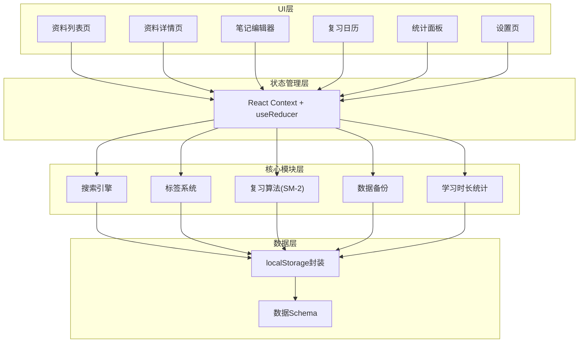
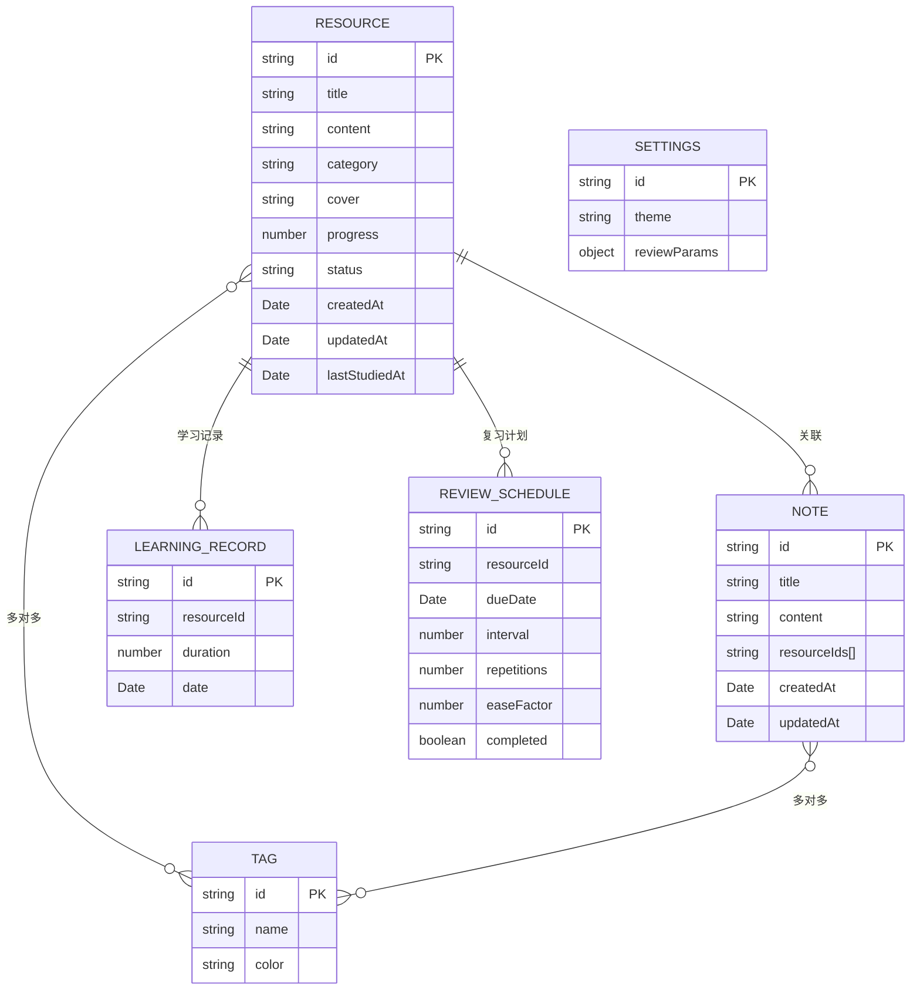

## 1. 架构设计

本项目为纯前端单页应用，所有数据存储在浏览器本地存储（localStorage）中，无需后端服务支持。采用模块化架构设计，核心业务逻辑与UI组件分离，便于维护和扩展。



## 2. 技术描述

### 2.1 技术栈选择

| 技术 | 版本 | 用途 |
|------|------|------|
| React | 18.x | UI框架，函数式组件 + Hooks |
| TypeScript | 5.x | 类型安全，提升代码可维护性 |
| Vite | 5.x | 构建工具，极速开发体验 |
| Tailwind CSS | 3.x | 原子化CSS框架，快速构建UI |
| React Router | 6.x | 单页路由管理 |
| Lucide React | ^0.344.0 | 图标库，简约线性风格 |
| Marked | ^12.0.0 | Markdown解析渲染 |
| DOMPurify | ^3.0.8 | HTML防XSS净化 |
| Day.js | ^1.11.10 | 日期时间处理 |
| Recharts | ^2.12.0 | 图表库，数据可视化 |

### 2.2 项目初始化

- 使用 `npm create vite@latest` 初始化React + TypeScript项目
- 安装Tailwind CSS及相关依赖
- 配置路径别名 `@` 指向 `src` 目录
- 配置ESLint + Prettier代码规范

### 2.3 目录结构

```
src/
├── assets/              # 静态资源
│   └── styles/          # 全局样式
├── components/          # 通用UI组件
│   ├── Layout/          # 布局组件
│   ├── Card/            # 卡片组件
│   ├── Tag/             # 标签组件
│   ├── SearchBar/       # 搜索栏组件
│   ├── ProgressBar/     # 进度条组件
│   └── Modal/           # 弹窗组件
├── pages/               # 页面组件
│   ├── ResourceList/    # 资料列表页
│   ├── ResourceDetail/  # 资料详情页
│   ├── NoteEditor/      # 笔记编辑器
│   ├── ReviewCalendar/  # 复习日历
│   ├── Statistics/      # 统计面板
│   └── Settings/        # 设置页
├── modules/             # 核心业务模块
│   ├── searchEngine.ts  # 搜索引擎
│   ├── tagSystem.ts     # 标签系统
│   ├── reviewAlgorithm.ts # 复习算法
│   ├── backup.ts        # 数据备份
│   └── statistics.ts    # 统计模块
├── store/               # 状态管理
│   ├── index.ts         # Context定义
│   ├── reducer.ts       # Reducer逻辑
│   └── actions.ts       # Action类型
├── types/               # TypeScript类型定义
│   └── index.ts
├── utils/               # 工具函数
│   ├── storage.ts       # localStorage封装
│   ├── date.ts          # 日期工具
│   └── markdown.ts      # Markdown工具
├── data/                # 示例数据
│   └── mockData.ts      # Mock数据
├── App.tsx              # 根组件
├── main.tsx             # 入口文件
└── router.tsx           # 路由配置
```

## 3. 路由定义

| 路由路径 | 页面名称 | 说明 |
|---------|---------|------|
| `/` | 资料列表页 | 默认首页，展示所有学习资料 |
| `/resource/:id` | 资料详情页 | 展示单个资料的详细内容和关联笔记 |
| `/notes` | 笔记列表 | 展示所有笔记，支持搜索和筛选 |
| `/notes/new` | 新建笔记 | 打开笔记编辑器创建新笔记 |
| `/notes/:id/edit` | 编辑笔记 | 编辑已有笔记 |
| `/review` | 复习日历 | 月历视图展示复习计划和任务 |
| `/statistics` | 统计面板 | 学习数据可视化仪表盘 |
| `/settings` | 设置页 | 数据管理、参数配置 |

## 4. 数据模型

### 4.1 数据实体关系



### 4.2 TypeScript类型定义

```typescript
// 资料
interface Resource {
  id: string;
  title: string;
  content: string;
  category: string;
  cover?: string;
  tags: string[];
  progress: number;
  status: 'not_started' | 'learning' | 'completed';
  createdAt: string;
  updatedAt: string;
  lastStudiedAt?: string;
}

// 笔记
interface Note {
  id: string;
  title: string;
  content: string;
  resourceIds: string[];
  tags: string[];
  createdAt: string;
  updatedAt: string;
}

// 标签
interface Tag {
  id: string;
  name: string;
  color: string;
}

// 学习记录
interface LearningRecord {
  id: string;
  resourceId: string;
  duration: number;
  date: string;
}

// 复习计划
interface ReviewSchedule {
  id: string;
  resourceId: string;
  dueDate: string;
  interval: number;
  repetitions: number;
  easeFactor: number;
  completed: boolean;
}

// 设置
interface Settings {
  theme: 'light' | 'dark';
  reviewParams: {
    initialInterval: number;
    easeFactor: number;
    minimumInterval: number;
  };
}

// 应用状态
interface AppState {
  resources: Resource[];
  notes: Note[];
  tags: Tag[];
  learningRecords: LearningRecord[];
  reviewSchedules: ReviewSchedule[];
  settings: Settings;
}
```

## 5. 核心模块设计

### 5.1 搜索引擎

**功能**：
- 全文搜索：支持对资料标题、内容、标签进行模糊匹配
- 关键词高亮：搜索结果中高亮显示匹配关键词
- 搜索评分：根据匹配位置、频率计算相关性得分
- 搜索历史：记录用户搜索历史，提供快速联想

**核心算法**：
- 倒排索引：对文档内容建立分词索引
- 模糊匹配：支持拼音首字母、部分匹配
- 结果排序：按相关性、最近学习时间综合排序

### 5.2 标签系统

**功能**：
- 标签CRUD：创建、编辑、删除标签
- 多标签关联：资料和笔记可关联多个标签
- 标签筛选：按标签筛选资料和笔记
- 标签云：展示标签使用频率

### 5.3 复习算法（SM-2）

基于SuperMemo 2间隔重复算法：

```
核心公式：
1. 计算新的易度因子：EF' = EF + (0.1 - (5 - q) * (0.08 + (5 - q) * 0.02))
   - EF为易度因子，初始值2.5
   - q为用户自我评估(0-5分)

2. 计算间隔天数：
   - 第1次复习：I(1) = 1天
   - 第2次复习：I(2) = 6天
   - 第n次复习(n>2)：I(n) = I(n-1) * EF
```

### 5.4 数据备份

**功能**：
- 导出备份：将所有数据导出为JSON文件
- 导入恢复：从JSON文件恢复数据
- 云存储可选：支持localStorage数据清理
- 版本检查：备份文件版本校验

### 5.5 学习时长统计

**功能**：
- 自动计时：进入详情页自动开始计时，离开时保存
- 手动记录：支持手动添加学习记录
- 统计聚合：按日、周、月维度统计学习时长
- 连续学习：追踪连续学习天数

## 6. 状态管理

采用React Context + useReducer方案：

```typescript
// Action类型
type Action =
  | { type: 'ADD_RESOURCE'; payload: Resource }
  | { type: 'UPDATE_RESOURCE'; payload: Resource }
  | { type: 'DELETE_RESOURCE'; payload: string }
  | { type: 'ADD_NOTE'; payload: Note }
  | { type: 'UPDATE_NOTE'; payload: Note }
  | { type: 'DELETE_NOTE'; payload: string }
  | { type: 'ADD_TAG'; payload: Tag }
  | { type: 'UPDATE_TAG'; payload: Tag }
  | { type: 'DELETE_TAG'; payload: string }
  | { type: 'ADD_LEARNING_RECORD'; payload: LearningRecord }
  | { type: 'UPDATE_REVIEW_SCHEDULE'; payload: ReviewSchedule }
  | { type: 'COMPLETE_REVIEW'; payload: string }
  | { type: 'UPDATE_SETTINGS'; payload: Partial<Settings> }
  | { type: 'IMPORT_DATA'; payload: AppState }
  | { type: 'CLEAR_DATA' };
```

## 7. 性能优化

- 数据持久化：使用防抖(debounce)优化localStorage写入
- 搜索性能：建立索引缓存，避免重复计算
- 组件优化：使用React.memo、useMemo、useCallback避免不必要重渲染
- 路由懒加载：按页面分割代码，减少首屏加载体积
- 虚拟列表：大量数据时使用虚拟滚动
